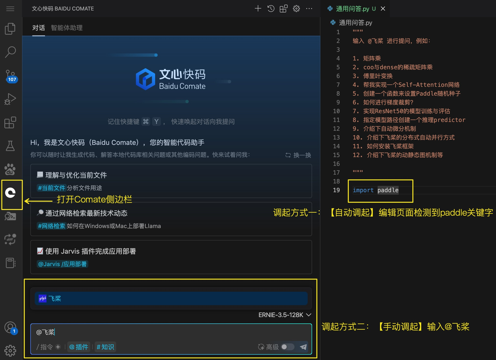
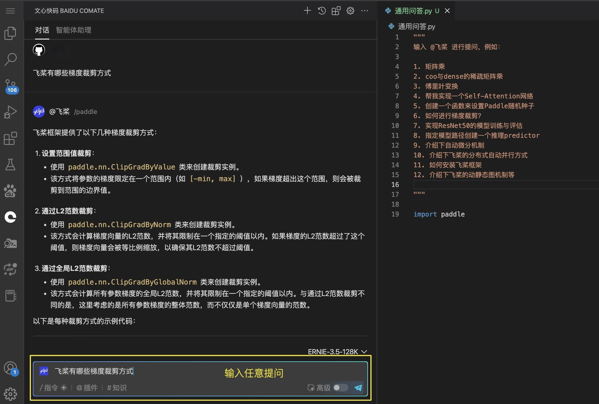
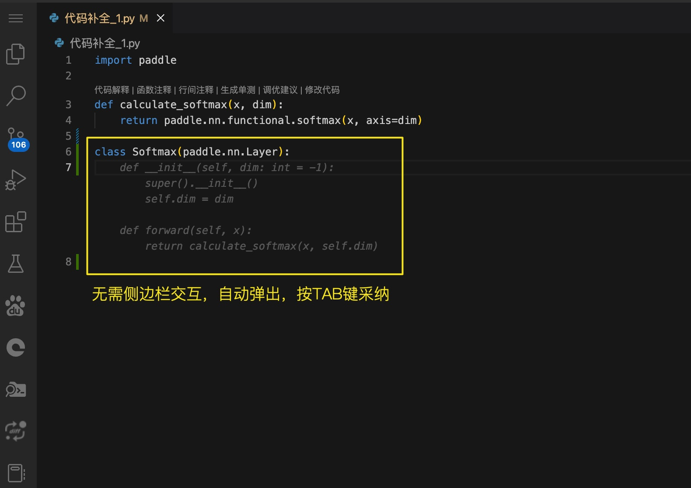
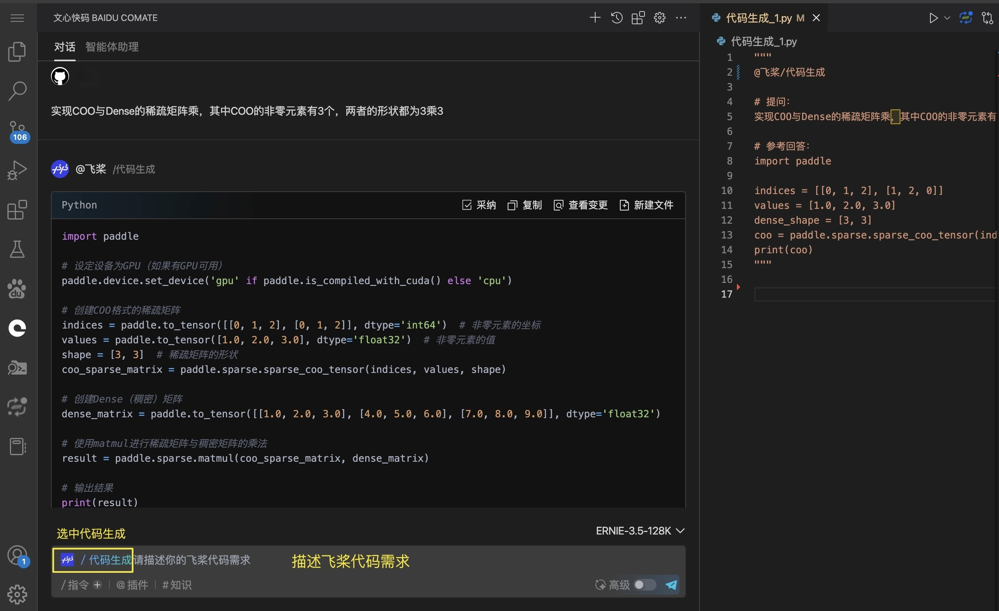
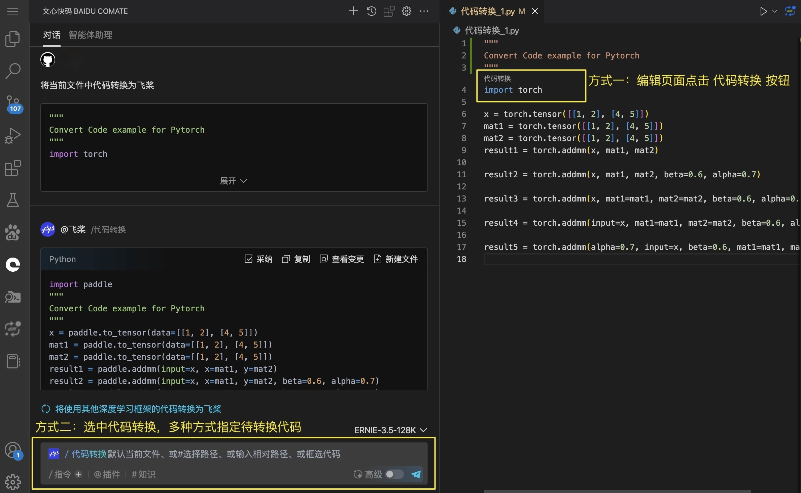
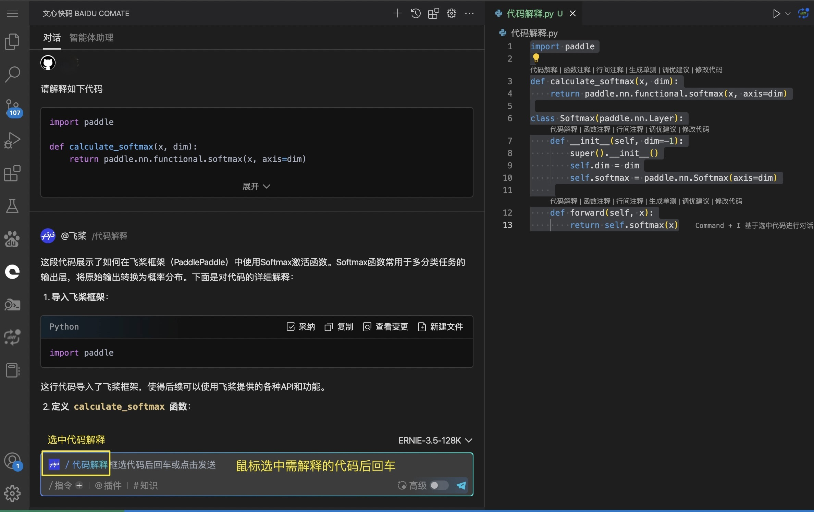

# 飞桨 AI 编程助手

随着大模型能力的不断增强，产学研各界越来越多的开发者开始使用大模型来辅助编程以提升开发效率。对于使用常见编程语言（如：Python、C++、Java 等）的开发者们，基于大模型的交互式编程能力已逐步释放出更多的增益，深受开发者欢迎。

**文心快码（Baidu Comate）** 是基于文心大模型（ERNIE-Bot）打造的交互式编程助手，为了助力飞桨开发者进一步提升开发效率，飞桨 3.0 在 Comate 中全新推出了 **飞桨 AI 编程助手** ，助力飞桨开发者们高效编写飞桨代码。

## 快速开始

首先你需要安装 **文心快码（Baidu Comate）** ，请参考 [下载 Baidu Comate](https://comate.baidu.com/zh/download) 进行安装。

接下来有两种调起 **飞桨 AI 编程助手** 的方式：
- 方式一：【自动调起】如果在编辑页面检测到 `import paddle` 关键字后会自动触发
- 方式二：【手动调起】在输入栏里输入 `@飞桨`

调起 **飞桨 AI 编程助手** 后，可使用以下五种能力。（后续新增更多能力中，敬请期待）

## 1. 默认能力（通用问答）
* 无需选中特定能力，默认情况下为通用问答，包括深度学习领域内的问题解答、代码生成、代码转换、代码解释和代码改写等各种能力，同时支持多轮问答
* 您可以灵活的发起对话，例如：
    1. 描述飞桨相关问题，例如：介绍下自动微分机制、介绍下飞桨的分布式自动并行方式、如何安装飞桨框架、介绍下飞桨的动静态图机制等
    2. 描述飞桨代码需求，例如：帮我编写模型组网函数、编写网络训练函数、调用深度学习框架接口、Resnet50 网络代码等
    3. 任意提问...

## 2. 代码补全
* 无需侧边栏交互，在编写代码过程中稍微停顿，则代码补全内容会自动弹出，按 TAB 键采纳

## 3. 代码生成
* 自动生成使用飞桨编写的代码，例如一键生成 **模型组网函数** 、**网络训练函数** 、**调用深度学习框架接口** 等
* 需要具体描述代码需求，例如：线性层网络、矩阵乘法、二维卷积、最大池化、cross-entropy 损失函数、正则化、梯度裁剪等
* 相比通用问答能力，代码生成能力更为定制化，可以更精准的满足编写飞桨代码的需求

## 4. 代码转换
* 将使用其他深度学习框架的代码（如 Pytorch、Tensorflow、Keras、MXNet、MindSpore 等），转换为使用飞桨框架的代码，支持项目一键迁移
* 针对 Pytorch 框架（推荐用法）：做了特殊调优，转换速度极快，支持文件与目录的 **批量/长文本转换**，且准确率更高
* 针对其他框架：使用普通大模型转换方式，转换速度一般
* 输入方式：
    1. 直接回车则默认转换 **当前文件**
    2. 使用 # 选择路径（文件或目录）
    3. 直接输入相对路径（文件或目录）
    4. 框选代码
* 相比通用问答能力，代码转换能力更为定制化，可以更精准的满足转换其他代码到飞桨的需求，且转换速度更快，准确率更高

## 5. 代码解释
* 结合飞桨专业知识与历史优秀代码集，对代码进行解释。直接 **框选代码** 后回车即可解释
* 相比通用问答能力，代码解释能力更为定制化，可以更精准的满足解释飞桨代码的需求

